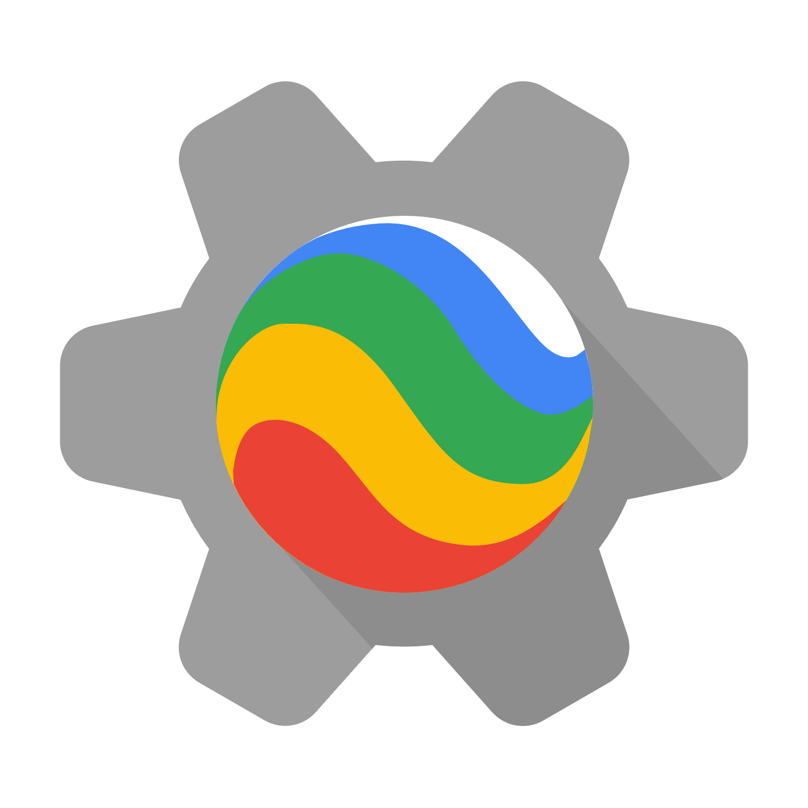

<div align="center">



# Earth Engine for VS Code

**Google Earth Engine directly inside your editor.**

[](https://marketplace.visualstudio.com/items?itemName=earthengine.earthengine)
[](https://marketplace.visualstudio.com/items?itemName=earthengine.earthengine)
[](https://marketplace.visualstudio.com/items?itemName=earthengine.earthengine)


[](https://www.typescriptlang.org/)
[](https://code.visualstudio.com/)
[](https://nodejs.org/)
[](https://developers.google.com/earth-engine)
[](https://conventionalcommits.org)

</div>

---

Bring the power of [Google Earth Engine](https://earthengine.google.com/) into VS Code. Browse your assets, monitor tasks, explore the STAC dataset catalog, search API docs, and visualize geospatial data on an interactive map — all without leaving your editor.

<!-- SCREENSHOT PLACEHOLDER — replace with actual screenshot once available -->
<!--  -->

---

## Features

### 🔐 Authentication — User accounts & Service accounts

Sign in with your Google account via OAuth2 (notebook PKCE flow) or add a service account key file. Multiple profiles are supported simultaneously — switch the active profile with one click.

- Green dot = active profile, red dot = inactive
- Credentials stored securely in `~/.config/earthengine/profiles/`
- Works with any Earth Engine-enabled Google Cloud project

---

### 🗂️ Asset Browser

Navigate your Earth Engine asset hierarchy directly in the sidebar.

- Lazy-loaded tree view with spinner placeholders for large asset libraries
- Supports **Images**, **ImageCollections**, **Tables (FeatureCollections)**, **Folders**
- **Preview panel**: inspect bands, properties, and features without writing a line of code
- **Asset Manager panel**: paginated table view, sortable columns, breadcrumb navigation
- Create subfolders inline via the **New Folder** button
- Copy any asset ID to clipboard in one click

<!-- SCREENSHOT PLACEHOLDER -->
<!--  -->

---

### ✅ Task Monitor

Keep an eye on your export and import jobs without switching to the Code Editor.

- Separate **Export Tasks** and **Import Tasks** sidebar panels
- Paginated task list (10 per page) with auto-refresh every 15 seconds
- Status icons: running, completed, failed, cancelled, pending
- Cancel a running task directly from the sidebar or the full table panel
- Full **Tasks Panel**: sortable by any column, paginated top & bottom

<!-- SCREENSHOT PLACEHOLDER -->
<!--  -->

---

### 🌍 Dataset Catalog

Browse the full Earth Engine STAC catalog without leaving VS Code.

- Three provider tiers: **Google**, **Publishers**, **Community**
- Lazy background resolution of dataset types (image, image collection, table…)
- **Dataset detail panel**: bands table, tags, code snippet, and direct link to the official catalog page
- Copy any dataset ID to clipboard

---

### 📖 API Docs

Searchable, offline-first Earth Engine JavaScript API reference.

- Hierarchical tree: `ee.Image`, `ee.FeatureCollection`, `ee.Reducer`…
- Rich tooltips per method: description, argument names & types, return type
- Search across all `ee.*` symbols instantly

---

### 🗺️ Interactive Map

Visualize Earth Engine layers on an interactive Leaflet map inside a VS Code panel.

- Three built-in base layers: OpenStreetMap, Satellite (ESRI), Terrain (ESRI)
- Layer control: toggle visibility, adjust opacity, remove layers
- **Python bridge**: a local HTTP server on port `31415` accepts commands from your Python scripts

#### Python usage

```python
import sys
sys.path.insert(0, "/path/to/extension/python")
from earthengine_vscode_map import Map

vis = {"min": 0, "max": 3000, "bands": ["B4", "B3", "B2"]}
Map.addLayer(ee_image.getMapId(vis)["tile_fetcher"].url_format, vis, "Landsat")
Map.centerObject(geometry, zoom=8)
```

<!-- SCREENSHOT PLACEHOLDER -->
<!--  -->

---

## Requirements

- **VS Code** 1.125 or later
- A [Google Earth Engine](https://signup.earthengine.google.com/) account
- A Google Cloud project with the **Earth Engine API** enabled
- **Python** (optional) — only needed for the map Python bridge

---

## Getting Started

1. Install the extension from the VS Code Marketplace
2. Click the **Earth Engine** icon in the Activity Bar
3. In the **Profiles** panel, click **Add Profile** ($(person-add)) to sign in with Google
   — or click **Add Service Account** ($(file-add)) to use a service account key
4. Select the profile to activate it (green dot = active)
5. Your assets, tasks, docs, and datasets will load automatically

---

## Extension Commands

| Command                     | Description                                    |
| --------------------------- | ---------------------------------------------- |
| `Add Profile`               | Sign in with a Google account via OAuth2       |
| `Add Service Account`       | Register a service account key file            |
| `Activate Profile`          | Switch to a different Earth Engine profile     |
| `Open Asset Manager`        | Open the full paginated asset table panel      |
| `Open Map View`             | Open the interactive Leaflet map panel         |
| `New Folder`                | Create a folder in your Earth Engine assets    |
| `Copy Asset ID`             | Copy a full asset name to clipboard            |
| `Open Details` (dataset)    | Open the STAC dataset detail panel             |
| `Open in Browser` (dataset) | Open the dataset page on developers.google.com |
| `Cancel Task`               | Cancel a running export or import task         |

---

## Extension Settings

| Setting      | Default | Description                                |
| ------------ | ------- | ------------------------------------------ |
| _(none yet)_ | —       | Settings will be added in a future release |

---

## Known Issues & Limitations

- The interactive map requires an active internet connection to load tile layers (CDN)
- The Python bridge server listens on `localhost:31415` — ensure the port is free
- Service account private keys are stored in `~/.config/earthengine/profiles/` in plain JSON (same location as the official `earthengine` CLI)
- API Docs are fetched from `developers.google.com` and cached for the session

---

## Development

This project uses a **Dev Container** for a consistent development environment.

### Prerequisites

- [VS Code](https://code.visualstudio.com/)
- [Docker](https://www.docker.com/) (running)
- [Dev Containers extension](https://marketplace.visualstudio.com/items?itemName=ms-vscode-remote.remote-containers)

### Getting Started

```bash
# Clone the repository
git clone https://github.com/your-org/earthengine-vscode
# Open in VS Code and reopen in Dev Container when prompted
```

- Press `F5` to launch the **Extension Development Host**
- The default build task (`Ctrl+Shift+B`) runs `watch:esbuild` and `watch:tsc` in parallel

### Useful Commands

| Command            | Description                     |
| ------------------ | ------------------------------- |
| `npx tsc --noEmit` | Type-check without emitting     |
| `node esbuild.js`  | Production build                |
| `npm run lint`     | Run ESLint on `src/`            |
| `npm run package`  | Bundle for publishing (`.vsix`) |

---

## Release Notes

### 0.0.1

- Initial release
- OAuth2 & service account authentication with multi-profile support
- Asset browser with lazy loading, preview panel, and asset manager
- Export & Import task monitor with auto-refresh and cancel
- STAC dataset catalog (Google / Publishers / Community)
- `ee.*` API docs tree with search and rich tooltips
- Interactive Leaflet map panel with Python bridge

---

<div align="center">

Made with ❤️ for the Earth Engine community

</div>
